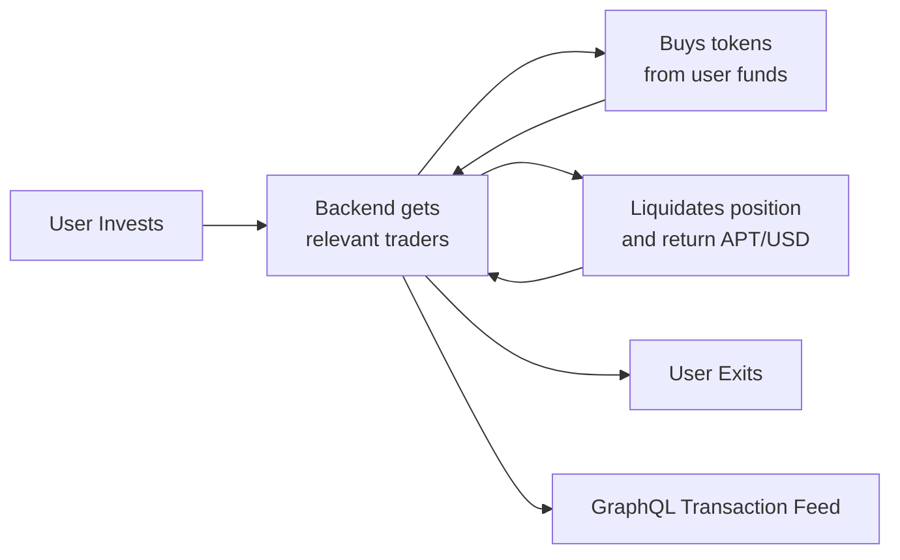

# TWDCA 

TWDCA is a decentralized copy-trading agent that automatically allocates user funds to the most relevant on-chain traders, mirrors their positions, and liquidates them to return profit (APT/USD) to the investor.

## Architecture / Workflow Diagram


### Mermaid Diagram



1. **User Invests** – The investor deposits funds through the dApp.  
2. **Backend Gets Relevant Traders** – The backend continuously ranks on-chain wallets and selects the best performing traders.  
3. **Buys Tokens From User Funds** – Selected trader positions are mirrored with the user's capital.  
4. **Liquidates Position & Returns APT/USD** – Positions are exited automatically based on strategy or when the user requests an exit.  
5. **All Transactions Exposed via GraphQL** – Every on-chain action is indexed and available through a GraphQL endpoint for transparency and analytics.

## Agent Wallet Address

```
0xd3b70f1f4b2d114f8240956ab4c261d40122979dfc5196ccc5a2ab0787a58dfb
```

## Contact

- **Name:** Priyanshu Ranjan  
- **Email:** <priyanshuranjan0001@gmail.com>

---

This is a [Next.js](https://nextjs.org) project bootstrapped with [`create-next-app`](https://nextjs.org/docs/app/api-reference/cli/create-next-app).

## Getting Started

First enter env details then run the development server:

```bash
npm run dev
# or
yarn dev
# or
pnpm dev
# or
bun dev
```

Open [http://localhost:3000](http://localhost:3000) with your browser to see the result.

You can start editing the page by modifying `app/page.tsx`. The page auto-updates as you edit the file.

This project uses [`next/font`](https://nextjs.org/docs/app/building-your-application/optimizing/fonts) to automatically optimize and load [Geist](https://vercel.com/font), a new font family for Vercel.

## Learn More

To learn more about Next.js, take a look at the following resources:

- [Next.js Documentation](https://nextjs.org/docs) - learn about Next.js features and API.
- [Learn Next.js](https://nextjs.org/learn) - an interactive Next.js tutorial.

You can check out [the Next.js GitHub repository](https://github.com/vercel/next.js) - your feedback and contributions are welcome!

## Deploy on Vercel

The easiest way to deploy your Next.js app is to use the [Vercel Platform](https://vercel.com/new?utm_medium=default-template&filter=next.js&utm_source=create-next-app&utm_campaign=create-next-app-readme) from the creators of Next.js.

Check out our [Next.js deployment documentation](https://nextjs.org/docs/app/building-your-application/deploying) for more details.
